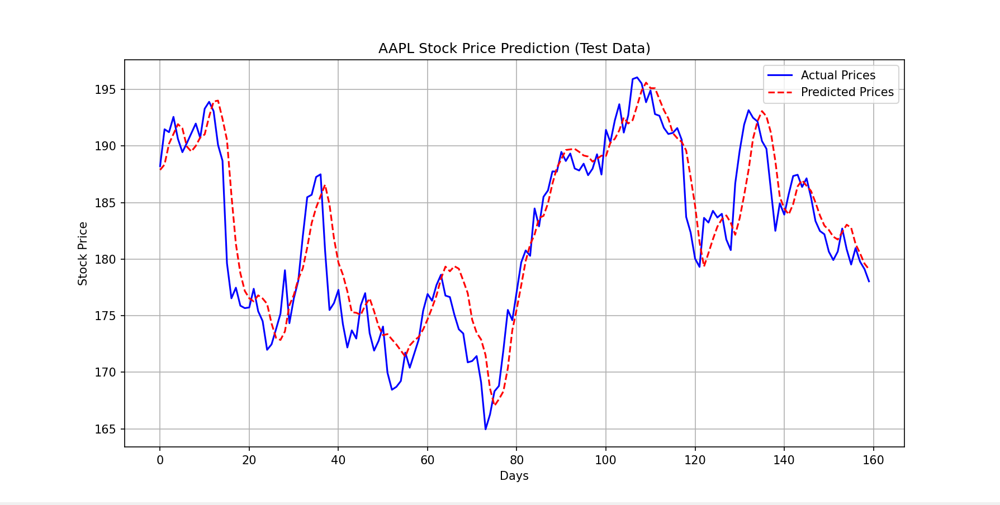

# Stock Market Prediction using LSTM

This project uses deep learning (LSTM neural networks) to predict stock prices based on historical data and technical indicators.

---

## Features

- Reliance stock minute-level prediction  
- Apple stock 30-day forecast  
- Tesla stock analysis and visualization  
- Tesla hourly prediction for next 5 days  

---

## Tech Stack

- Python  
- TensorFlow / Keras  
- Scikit-learn  
- Pandas  
- Matplotlib  
- Yahoo Finance API  

---

## Project Structure
stock-market-prediction-ml
│
├── data
├── models
├── notebooks
├── src
│ ├── apple_prediction.py
│ ├── reliance_prediction.py
│ ├── tesla_analysis.py
│ └── tesla_future_prediction.py
│
├── requirements.txt
└── README.md

---
## Project Demo Flow

1. User selects a stock (Apple, Tesla, Reliance)
2. Historical stock data is fetched using yfinance
3. Data is preprocessed and scaled
4. LSTM model is trained on past stock prices
5. Model predicts future stock trends
6. Results are visualized using graphs

## Model

The project uses a **Bidirectional LSTM model** to capture time-series dependencies in stock price movements.

---

## Key Concepts Used

- Time Series Forecasting
- LSTM (Long Short-Term Memory)
- Data Normalization
- Sequential Modeling
- Technical Indicators (SMA, RSI)

## Evaluation Metrics

- R² Score  
- Mean Absolute Error (MAE)  
- Root Mean Squared Error (RMSE)  

---

## Future Improvements

- Add more technical indicators  
- Deploy as a web application  
- Improve prediction accuracy using advanced models 

## Output

### Apple Stock Prediction
